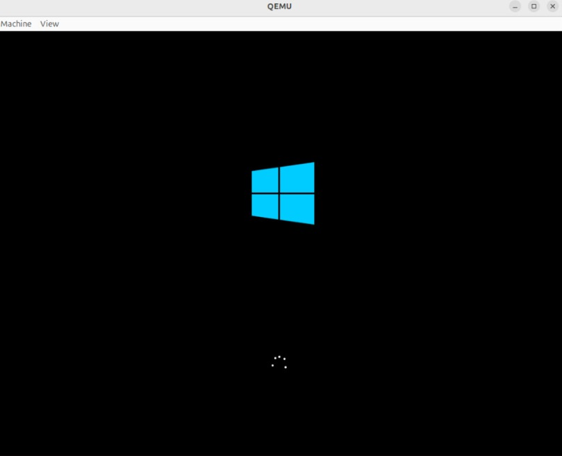

# Tarea 8 Proyecto de Máquinas Virtuales y Comunicación en Red

**Autor:** Rodian Daniel Garay Peralta  
**Fecha:** Octubre de 2025  
**Asignatura:** Sistemas Operativos / Virtualización  
**Monitor:** Melanie  

---

## Descripción General

Este proyecto tiene como objetivo crear tres máquinas virtuales (Rocky Linux, Kali Linux y Windows), configurarlas correctamente dentro de un entorno de red interna y comprobar que se puedan comunicar entre sí mediante pruebas de conectividad.  

La práctica permite comprender el funcionamiento de las máquinas virtuales, la gestión de redes dentro de entornos virtualizados y la interoperabilidad entre diferentes sistemas operativos.

---

## Propósito de la Práctica

- Desarrollar habilidades en la instalación y configuración de sistemas operativos virtualizados.  
- Comprender los conceptos de redes internas, adaptadores de puente y comunicación entre máquinas.  
- Realizar pruebas de conectividad y verificación de red (ping entre equipos).  
- Documentar todo el proceso de manera técnica y ordenada.

---

## Materiales y Requisitos

| Elemento | Descripción |
|-----------|--------------|
| **Software de virtualización** | Oracle VirtualBox (o VMware Workstation) |
| **Imágenes ISO** | Rocky Linux, Kali Linux, Windows 10/11 |
| **Recursos del host** | 8 GB RAM, 100 GB disco libre (mínimo) |
| **Conexión a Internet** | Para descargas e instalación de actualizaciones |
| **Herramientas de red** | `ping`, `ipconfig`, `ifconfig`, `nmcli` |

---

## Estructura del Repositorio
```
Proyecto-VMs/
│
├── README.md
├── Paso1_RockyLinux.md
├── Paso2_KaliLinux.md
├── Paso3_Windows.md
├── Paso4_Comunicacion.md
└── Capturas/
├── rocky_instalacion.png
├── kali_ping.png
├── windows_config.png
└── red_comunicacion.png
```

---

## Paso a Paso de la Configuración

### 1. Creación de máquina virtual – Rocky Linux
1. Abrir VirtualBox → “Nueva”.
2. Nombre: `RockyLinux`  
   Tipo: `Linux`, Versión: `Red Hat (64-bit)`.
3. Asignar 2 GB de RAM y 20 GB de disco dinámico.
4. Montar la ISO de Rocky Linux.
5. Instalar el sistema operativo, crear usuario y contraseña.
6. Asignar nombre de host `rocky.local`.
7. Verificar conexión a internet con:
   ```bash
   ping 8.8.8.8
## 2. Creación de máquina virtual – Kali Linux

1. Crear nueva máquina → Nombre KaliLinux.

2. Tipo: Linux, Versión: Debian (64-bit).

3. Asignar 2 GB de RAM, 20 GB de disco.

4. Montar ISO de Kali Linux.

5. Instalar normalmente con usuario kali.

6. Asignar nombre de host kali.local.

7. Actualizar paquetes:

```
sudo apt update && sudo apt upgrade -y
```

## 3. Creación de máquina virtual – Windows

Crear nueva máquina → Nombre Windows.

Tipo: Microsoft Windows, Versión: Windows 10 (64-bit).

Asignar 4 GB RAM y 40 GB de disco.

Montar ISO de Windows 10 o 11.

Instalar siguiendo el asistente.

Crear usuario admin y configurar idioma/español.

Verificar red con:
```
ping 8.8.8.8
```
## 4. Configuración de red y comunicación entre máquinas

En VirtualBox → Configuración → Red → seleccionar “Red Interna”.

Nombre de red interna: RedLab.

Configurar IPs estáticas en cada sistema:

Rocky Linux
```
sudo nmcli con mod "Wired connection 1" ipv4.addresses 192.168.10.10/24
sudo nmcli con mod "Wired connection 1" ipv4.method manual
sudo nmcli con up "Wired connection 1"
```
Kali Linux
```
sudo nano /etc/network/interfaces
# Agregar:
auto eth0
iface eth0 inet static
address 192.168.10.11
netmask 255.255.255.0
gateway 192.168.10.1
```  
Windows

Panel de control → Red e Internet → Cambiar configuración del adaptador.

Propiedades de IPv4 → Asignar:

IP: 192.168.10.12

Máscara: 255.255.255.0

Puerta de enlace: 192.168.10.1

 ## 5. Pruebas de conectividad

Desde Rocky Linux:
```
ping 192.168.10.11
ping 192.168.10.12
```

Desde Kali Linux:
```
ping 192.168.10.10
ping 192.168.10.12
```

Desde Windows:
```
ping 192.168.10.10
ping 192.168.10.11
```

## Imagenes del paso a paso 
### Rocky linux
  
  
  
  

### Kali linux 
  
  
### Windows
  
  
  
  
  


